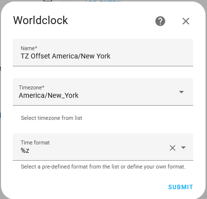

####
#
# BRICKMASTER
#
####

# Installation Instructions

## Linux

Assumes Raspberry Pi OS/Rasbian on a Pi.

_Probably works for other Linux versions, but not tested, adapt as appropriate._

### Basic Setup

1. Install your Pi as per standard instructions.
2. Create a virtual environment for Brickmaster.


    `python -m venv ~/venv-brickmaster`
3. Enter the venv.


    `source ~/venv-brickmaster/bin/activate`
4. Install Brickmaster.


    `pip install brickmaster`
5. Create a config file, ie: `~/config.json`. You can copy one of the 
[example hardware configurations](https://github.com/chrisgilldc/brickmaster/tree/main/hwconfigs) or create one from 
scratch.
6. If using scripts, create a directory for scripts.


    `mkdir ~/scripts`

7. Test the script

    
    `brickmaster -c ~/config.json`

### Starting Automatically

Do the following to be sure Brickmaster start automatically on boot.

1. Create a user unit directory.

    `mkdir -p ~/.config/systemd/user`

2. Copy the [example systemd unit](https://github.com/chrisgilldc/brickmaster/blob/main/examples/brickmaster.service) into `~/.config/systemd/user/brickmaster.service`
3. If you used any different settings in the basic setup, such as a different virtualenv directory or config file name, update the unit file to match. 
4. Have systemd reload the user units so brickmaster is available.

     `systemctl --user daemon-reload`
5. Start brickmaster.

     `systemctl --user start brickmaster.service`
6. Check the status of the unit. Be sure the active line says `active (running)`.

     `systemctl --user status brickmaster.service`

7. If it started successfully, enable the unit.

     `systemctl --user enable brickmaster.service`
8. Enable linger for the user. This will start the user's systemd instance on system boot and in turn start
brickmaster.

     `sudo loginctl enable-linger pi`

## Circuitpython boards with Web Workflow

### Prepare the board.

1. Flash the board to the latest CircuitPython. Instructions for the ESP32 Feather V2 can be found [here](https://learn.adafruit.com/adafruit-esp32-feather-v2/circuitpython).
2. Configure the basic settings in `settings.toml`. You can copy-based the below into the serial console. Be sure to put
in your SSID and Password. Optionally, you can include "CIRCUITPY_WEB_INSTANCE_NAME" to set the board name. Brickmaster
will also use this to set the hostname.
```
f = open('settings.toml','w')
f.write('CIRCUITPY_PYSTACK_SIZE = 4096\n')
f.write('CIRCUITPY_WIFI_SSID = "<SSID>"\n')
f.write('CIRCUITPY_WIFI_PASSWORD = "<PASSWORD>"\n')
f.write('CIRCUITPY_WEB_API_PASSWORD = "changeme1234"\n')
f.write('CIRCUITPY_WEB_INSTANCE_NAME = "<BOARD NAME>"\n')
f.close()
```
3. Reset the board with a CTRL-D or by pressing the button. When the board restarts, you should see the IP address 
appear in the terminal status bar.

### Install Brickmaster

1. Set up a Python venv.

`python -m venv bm-setup`
2. Enter the venv. This varies by platform, ie: `source ./bm-setup/bin/activate` for Linux.
3. Install circup.
 
`pip install circup`

6. Download the [latest release](http://github.com/chrisgilldc/brickmaster/releases/latest) and extract.
6. Install the circuitpython requirements.

`circup --host <IP> --password <PASSWORD> install -r circuitpytyhon\requirements.txt`
7. Install Brickmaster itself.

`circup --host <IP> --password <PASSWORD> install -r .\brickmaster`
8. Write a `config.json` and upload via the web interface. 
9. Via the web interface, upload `circuitpython\code.py` to the filesystem root. 
10. Board should now restart and come up correctly. Monitor the console to confirm correct operation.

### Configuring time for Circuitpython

Getting correct time for Circuitpython is a hairy business. Specifically, time*zones* are hairy. There isn't a current, 
well-maintained timezone database for Circuitpython to allow everything to be done on-board. Getting both time and zone
via MQTT has known inaccuracies.

Brickmaster takes a hybrid approach.

Time is set via NTP and sets the board's real-time clock to UTC.
Timezone information is obtained through MQTT.

Use World Clock sensors and an automation in HA to publish the current offset to the topic.

#### Set up sensors
Create [World Clock](https://www.home-assistant.io/integrations/worldclock/) sensors in Home Assistant, one for each 
time zone you need.

Note that a separate zone is *NOT* needed for UTC.

Use the time format '%z'. This will return only the UTC offset for the zone.

For example, to create an offset zone for the US East Coast:


### Set up Automation
Create an automation to push the value of this sensor out to MQTT.
An example automation is in examples/ha_timezone_automation.yaml
